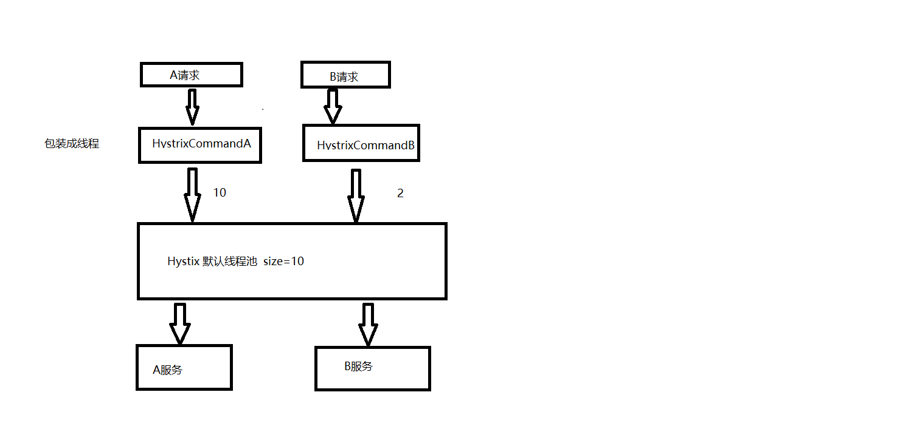

# 概述

在分布式系统中，服务调用服务，当被调用的服务超时或异常等待，调用方的线程会一直等待结果，导致线程被长时间占用，消耗资源，最终导致雪崩，服务器崩溃

hystrix 是一个断路器组件，当服务异常时，返回一个可以处理的响应，而不是长时间等待

主要功能，1，超时控制，2，优雅降级，提供备用方案

如果自己实现，超时则需要在httpclient等发起请求的做超时设置，很难做不同的配置，备用方案使用try，catch做备份。

# 熔断

生产者引入依赖

```xml
<dependency>
    <groupId>org.springframework.cloud</groupId>
    <artifactId>spring-cloud-starter-netflix-hystrix</artifactId>
</dependency>
```

主启动类开启，断路器

```java
@SpringBootApplication
@EnableCircuitBreaker
public class SbdemoApplication {
```

编写备用方法，使用`HystrixCommand`注解绑定一个回调方法，注意参数和返回值必须和 requestMapping 一样

当原请求抛出异常时，则会调用备用方法

```java
@RequestMapping("student/{id}")
@HystrixCommand(fallbackMethod = "studentFall")
public String student(@PathVariable Integer id){
    if(id==2){
        throw new RuntimeException("is not exist");
    }
    return "hello student ,penglingfeng";
}

public String studentFall(Integer id){
    return "student is not exist,hy";
}
```

# 降级

当硬件资源不够时，需要将服务停掉，为了防止消费者没有响应，在消费者端，提供 fallback 回调

基于之前的 feign 架构,无需添加 hystrix 依赖

指定回调工厂,注意该接口的 `@PathVariable("id")`要指定参数名，而不是`@PathVariable`

```java
@FeignClient(value = "SBPRO",fallbackFactory = StudentServiceFallbackFactory.class)
public interface StudentService {

    @RequestMapping("student/{id}")
    String student(@PathVariable("id") Integer id);
}
```

使用方式不变

```java
@Autowired
private StudentService studentService;

@ResponseBody
@RequestMapping("hello/{id}")
public String hello(@PathVariable Integer id) {
    log.info(student.toString());
    String result = studentService.student(id);
    return "hello fei " + result;
}
```

编写 回调工厂,实现 `feign.hystrix.FallbackFactory`接口，返回用于异常情况的回调。要实例化到容器中

```java
@Component
public class StudentServiceFallbackFactory implements FallbackFactory<StudentService> {
    @Override
    public StudentService create(Throwable throwable) {
        return new StudentService() {
            @Override
            public String student(Integer id) {
                return "student service is close";
            }
        };
    }
}
```

开启 feign.hystrix

```yaml
feign:
  hystrix:
    enabled: true
```

当使用 feign 接口时，把生产者关闭，将使用回调工厂的回调，重启生产者，又能继续调用生产者

# 监控

hystrix 提供了一个仪表盘，用于监控

## 服务器

新建项目，引入依赖。dashboard 会自动依赖 web-starter

```xml
<dependency>
    <groupId>org.springframework.cloud</groupId>
    <artifactId>spring-cloud-starter-netflix-hystrix</artifactId>
</dependency>
<dependency>
    <groupId>org.springframework.cloud</groupId>
    <artifactId>spring-cloud-starter-netflix-hystrix-dashboard</artifactId>
</dependency>
```

yml 暴露端口即可，不用注册进 eureka

```yaml
server:
  port: 7001
```

主启动类使用注解`@EnableHystrixDashboard`

```java
@SpringBootApplication
@EnableHystrixDashboard
public class HyApplication {
```

启动项目，访问 `http://localhost:7001/hystrix `

## 客户端

对于要监控的服务，引入依赖

```xml
<dependency>
    <groupId>org.springframework.cloud</groupId>
    <artifactId>spring-cloud-starter-netflix-hystrix</artifactId>
</dependency>
<dependency>
    <groupId>org.springframework.boot</groupId>
    <artifactId>spring-boot-starter-actuator</artifactId>
</dependency>
```

启动类配置 `@EnableHystrix`

```java
@EnableHystrix
@SpringBootApplication
@EnableFeignClients(basePackages = "com.plf.sb.service")
public class PlfApplication {
```

yml配置

```yaml
management:
  endpoints:
    web:
      exposure:
        include: "*"
```

页面访问 `http://localhost:8081/actuator/hystrix.stream` ，即可得到监控信息，不过是json格式的，把该地址拷贝进服务器提供的页面，进行监控


# hystrix 原生使用

现在有一个 controller

```java
@RestController
public class HelloController {

    @Autowired
    private HelloService helloService;

    @GetMapping("/hello")
    public String hello() {
        return helloService.hello("张三");
    }
}
```

和需要调用的service

```java
@Service
public class HelloService {

    public String hello(String name) {
        return "hello," + name;
    }
}
```

需要对目标方法做熔断，使用原生 hystrix 的形式,引入依赖

```xml
<dependency>
    <groupId>com.netflix.hystrix</groupId>
    <artifactId>hystrix-core</artifactId>
    <version>1.5.18</version>
</dependency>
```

针对需要熔断的方法，编写 Command 类。

继承`com.netflix.hystrix.HystrixCommand`，泛型为对应方法的返回值。被调用的对象和参数作为属性，对象一般在构造方法中注入，参数通过set方法，构造器中需要调用父构造器指定 command 组。

重写 run 方法，run方法中使用原本的实现

重写 getFallback 方法，此方法是，原方法报错后，作为的备用方法。

```java
public class HelloServiceHelloCommand extends HystrixCommand<String> {

    private HelloService helloService;

    private String name;

    public HelloServiceHelloCommand(HelloService helloService) {
        super(Setter.withGroupKey(HystrixCommandGroupKey.
                                  Factory.asKey("HelloServiceHelloCommandGroup")));
        this.helloService = helloService;
    }

    public void setName(String name) {
        this.name = name;
    }

    @Override
    protected String run() throws Exception {
        return helloService.hello(name);
    }

    @Override
    protected String getFallback() {
        return "hello服务开小差了";
    }
}
```

为了能看见效果,修改 HelloService ,每三次调用出一个异常

```java
@Service
public class HelloService {

    int i = 0;

    public String hello(String name) {
        if (i++ % 3 == 0) {
            throw new RuntimeException("异常");
        }
        return "hello," + name;
    }
}
```

当出异常时，不再是报错，而是走我们的 fallback 方法

## command作为bean

当配置command为一个bean时，第二次调用会抛出

```
java.lang.IllegalStateException: 
This instance can only be executed once. Please instantiate a new instance.
```

意为，一个command实例只能调用一次,需要创建一个新的实例。

因此，需要指定bean的作用域为 prototype ,不再为单例。构造注入HelloService

```java
@Component
@Scope(ConfigurableBeanFactory.SCOPE_PROTOTYPE)
public class HelloServiceHelloCommand extends HystrixCommand<String> {

    private HelloService helloService;

    private String name;

    @Autowired
    public HelloServiceHelloCommand(HelloService helloService) {
        super(Setter.withGroupKey(HystrixCommandGroupKey.Factory.asKey("HelloServiceHelloCommandGroup")));
        this.helloService = helloService;
    }
    // 省略
```

而在使用时,每次都通过 `ApplicationContext` 得到bean

```java
@Autowired
private ApplicationContext context;

@GetMapping("/hello")
public String hello() {
    HelloServiceHelloCommand helloServiceHelloCommand = context.getBean(HelloServiceHelloCommand.class);
    helloServiceHelloCommand.setName("张三");
    return helloServiceHelloCommand.execute();
}
```

## 注解形式

springboot项目中引入依赖,`hystrix-javanica`已经依赖了 `hystrix-core`

```xml
<dependency>
    <groupId>com.netflix.hystrix</groupId>
    <artifactId>hystrix-javanica</artifactId>
    <version>1.5.18</version>
</dependency>
```

配置一个切面的bean，开启注解编程

```java
@Bean
public HystrixCommandAspect hystrixCommandAspect(){
    return new HystrixCommandAspect();
}
```

直接修改原方法,使用注解指定一个备用方法，返回值参数需一致

```java
@RestController
public class HelloController {

    @Autowired
    private HelloService helloService;

    @HystrixCommand(fallbackMethod = "helloFallback")
    @GetMapping("/hello")
    public String hello() {
        return helloService.hello("张三");
    }

    public String helloFallback(){
        return "hello服务开小差了 anno";
    }
}
```

# 参数配置

## commandProperties

`CIRCUIT_BREAKER_REQUEST_VOLUME_THRESHOLD` : 设置统计请求的最小数量，至少满足这个数量才会判断是否需要断路 ，默认 20 

`CIRCUIT_BREAKER_ERROR_THRESHOLD_PERCENTAGE` ： 失败请求的百分比阈值，超过这个阈值，将会开启断路, 默认 50

`CIRCUIT_BREAKER_SLEEP_WINDOW_IN_MILLISECONDS` : 已经被断路后，尝试恢复的时间间隔，到了这个时间间隔，会放一个请求走原方法，决定是否继续断路，默认 5000 ms

`EXECUTION_ISOLATION_THREAD_TIMEOUT_IN_MILLISECONDS` : 配置超时的等待时间，请求超过该参数设置的时间，则触发熔断，默认 1000 ms

`METRICS_ROLLING_STATS_TIME_IN_MILLISECONDS` ：统计请求的窗口时间，默认 10000 ms

## threadPoolProperties

`CORE_SIZE` : 线程池的核心大小 ，默认 10


# 实现原理

带有注解的方法，会被包装为一个线程，交给线程池来执行。默认的线程池的size为10

默认为每一个类创建一个线程池，类中的各种command共用这一个线程池



```bash
jps
jstack pid |grep -i hystrix-
```

可以通过设置，线程池大小

```java
@DefaultProperties(threadPoolProperties = {
        @HystrixProperty(name = CORE_SIZE,value = "15")
})
```

不同组的命令，放在不同的类中

线程池的名称默认为类名 ，可以通过 `threadPoolKey`  修改

默认的等待线程数为0，拒绝超过线程池大小的其他线程，可以通过`MAX_QUEUE_SIZE` 设置运行等待的线程数

# 工作流程

1,当服务调用出错时，开启一个时间窗口计数（默认10s）

2，如果在这个时间窗口中，请求数达到了用于统计的最小请求数，则统计失败的请求的百分比，

如果超过了阈值，则触发熔断，熔断器处于一个 半开的状态

3，熔断器触发，则会开启一个检测的活动窗口期（默认5s），每隔5s会放行一个请求，来验证

目标服务是否健康，健康则重置断路器。