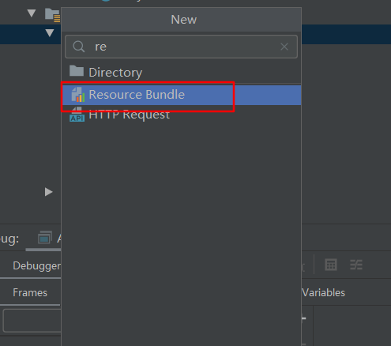
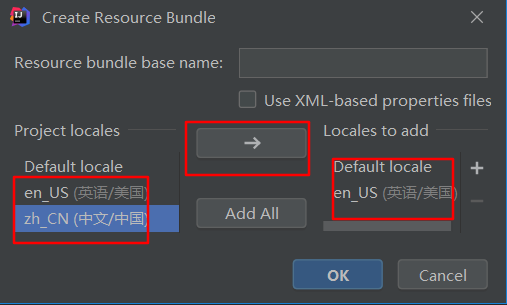
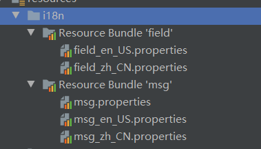
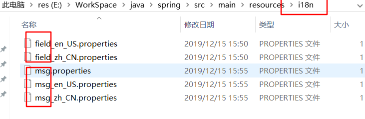

# ioc容器

ioc 容器通过配置，对象通过构造方法，工厂方法，或设置属性创建实例，然后注入依赖项

核心接口`BeanFactory`,提供了容器的基本功能，而`ApplicationContext`是它的子类，提供了更多的功能

`ApplicationContext`通过xml配置，java配置类，java注解等方式获取配置信息，通过配置信息实例化一个可用的对象，通常称之为bean

在独立的应用程序中，通常使用`FileSystemXmlApplicationContext` 和 `ClassPathXmlApplicationContext` 来读取xml形式的配置文件，并得到上下文对象

配置过程为，业务类+配置 传入 容器，得到可用的业务类实例

而spring的xml配置推荐使用idea和sts生成

引入依赖spring-context

```xml
<dependency>
    <groupId>org.springframework</groupId>
    <artifactId>spring-context</artifactId>
    <version>5.2.1.RELEASE</version>
</dependency>
```

在类路径下（对应maven项目的resources下），生成spring的xml配置文件

```xml
<?xml version="1.0" encoding="UTF-8"?>
<beans xmlns="http://www.springframework.org/schema/beans"
       xmlns:xsi="http://www.w3.org/2001/XMLSchema-instance"
       xsi:schemaLocation="http://www.springframework.org/schema/beans http://www.springframework.org/schema/beans/spring-beans.xsd">

</beans>
```

读取类路径下的配置文件，创建上下文实例

```java
ApplicationContext context = new ClassPathXmlApplicationContext("spring.xml");
```

可以传入多个配置文件,不同配置下同一个容器的bean可以相互引用

```java
ApplicationContext context = new ClassPathXmlApplicationContext("spring.xml","spring-context.xml");
```

或是在一个xml配置中引入其他配置，通过`import`标签指定路径

```xml
<?xml version="1.0" encoding="UTF-8"?>
<beans xmlns="http://www.springframework.org/schema/beans"
       xmlns:xsi="http://www.w3.org/2001/XMLSchema-instance"
       xsi:schemaLocation="http://www.springframework.org/schema/beans http://www.springframework.org/schema/beans/spring-beans.xsd">

    <import resource="spring/spring-context.xml"/>

</beans>
```

相对路径不推荐使用`../` 。也可以加上`classpath:`前缀指定类路径的绝对路径

```xml
<import resource="classpath:/spring/spring-context.xml"/>
```

容器实例化就可以使用了，假如你有如下配置,定义了一个student

```xml
<?xml version="1.0" encoding="UTF-8"?>
<beans xmlns="http://www.springframework.org/schema/beans"
       xmlns:xsi="http://www.w3.org/2001/XMLSchema-instance"
       xsi:schemaLocation="http://www.springframework.org/schema/beans http://www.springframework.org/schema/beans/spring-beans.xsd">

    <bean id="student" class="com.plf.spring.model.Student">
        <property name="studentId" value="123"/>
        <property name="studentName" value="zs"/>
    </bean>
    
</beans>
```

直接使用`getBean`方法指定id得到该对象，接下来会详解bean的配置

```java
Student student = context.getBean("student", Student.class);
```

# bean 配置

## 命名

一个bean通过id和name来指定名称，id在一个容器中是**唯一**的。如果不指定id，容器会默认给一个唯一的id，如果想要指定别名，使用name，可以通过  逗号`,` 分号 `;` 和空格隔开多个别名。

如果一个bean不会被别的bean引用，可以不指定id和name 

```xml
<bean id="student" name="student2,student3;student4 student5" class="com.plf.spring.model.Student">
    <property name="studentId" value="123"/>
    <property name="studentName" value="zs"/>
</bean>
```

使用的时候，id和name都可以得到bean

```java
Student student = context.getBean("student2", Student.class);
```

还可以通过`alias`标签在外部指定别名

```xml
<bean id="student" class="com.plf.spring.model.Student">
    <property name="studentId" value="123"/>
    <property name="studentName" value="zs"/>
</bean>

<alias name="student" alias="student6"/>
```

## 实例化

### 无参构造器

大多数情况下，通过无参构造器创建实例，通过class属性指定全类名即可

```java
<bean id="student" class="com.plf.spring.model.Student"/>
```

需要有一个无参构造器,实例化的时候会调用该方法

```java
public Student() {
    System.out.println("empty param constructor");
}
```

### 静态工厂方法

假如我们想通过某个工厂类的静态方法得到实例

```java
public class StudentFactory {
    public static Student createStudent(){
        return new Student();
    }
}
```

则指定class属性为工厂类，和`factory-method`属性指定一个静态方法

```xml
<bean id="student2" class="com.plf.spring.factory.StudentFactory" factory-method="createStudent"/>
```

### 实例工厂方法

如果该工厂创建实例的方法不是静态方法

```java
public class StudentFactory {
    public Student createStudent(){
        return new Student();
    }
}

```

则需要先实例化工厂，通过`factory-bean`指定工厂实例的引用，再指定创建实例的方法

```xml
<bean id="studentFactory" class="com.plf.spring.factory.StudentFactory"/>

<bean id="student2" factory-bean="studentFactory" factory-method="createStudent"/>
```

# 依赖注入

当一个要实例化的对象，需要一些属性的时候，通过依赖注入设置属性

`ref` 属性指定依赖的实例对象 ，`value` 属性指定值

## 构造注入

使用构造方法注入依赖

当不存歧义时，可以直接使用通过ref引入实例，注入到属性中

```java
public class Student {

    private Book book;
    private Subject subject;

    public Student() {
    }

    public Student(Book book, Subject subject) {
        this.book = book;
        this.subject = subject;
    }
}
```

当不存歧义时，可以直接使用`constructor-arg` ,无关参数类型和顺序

```xml
<bean id="student" class="com.plf.spring.model.Student">
    <constructor-arg ref="subject"/>
    <constructor-arg ref="book"/>
</bean>

<bean id="book" class="com.plf.spring.model.Book"/>

<bean id="subject" class="com.plf.spring.model.Subject"/>
```

### 指定类型

可以通过指定类型消除歧义

```java
public class Student {

    private String stuName;
    private int age;

    public Student() {
    }

    public Student(String stuName, int age) {
        this.stuName = stuName;
        this.age = age;
    }
}
```

通过type指定数据类型

```xml
<bean id="student" class="com.plf.spring.model.Student">
    <constructor-arg type="int" value="123"/>
    <constructor-arg type="java.lang.String" value="321"/>
</bean>
```

### 指定下标

通过index属性指定参数顺序，从0开始

```xml
<bean id="student" class="com.plf.spring.model.Student">
    <constructor-arg index="0" value="123"/>
    <constructor-arg index="1" value="321"/>
</bean>
```

### 指定名称

还可通过name属性指定参数名称

```xml
<bean id="student" class="com.plf.spring.model.Student">
    <constructor-arg name="stuName" value="123"/>
    <constructor-arg name="age" value="321"/>
</bean>
```

## setter注入

通过`property` 标签指定属性名称，对象通过ref，值通过value注入

```xml
<bean id="student" class="com.plf.spring.model.Student">
    <property name="book" ref="book"/>
    <property name="stuName" value="zs"/>
</bean>

<bean id="book" class="com.plf.spring.model.Book"/>
```

## 工厂方法注入参数

```java
public class StudentFactory {
    public static Student createStudent(String stuName, Book book){
        Student student = new Student();
        student.setBook(book);
        student.setStuName(stuName);
        return student;
    }
}
```

如果使用工厂方法，则需要通过`constructor-arg`标签传入参数

```xml
<bean id="student" class="com.plf.spring.factory.StudentFactory" factory-method="createStudent">
    <constructor-arg name="stuName" value="zs"/>
    <constructor-arg name="book" ref="book"/>
</bean>

<bean id="book" class="com.plf.spring.model.Book"/>
```

## 引用bean名称

如果需要注入的不是一个类型的引用，而是bean的name的字符串

```java
public class Student {

    private String stuName;
    private String bookBeanName;
```

可以使用`idref` 来指定bean的名称

```xml
<bean id="student" class="com.plf.spring.model.Student">
    <property name="bookBeanName">
        <idref bean="book"/>
    </property>
</bean>

<bean id="book" class="com.plf.spring.model.Book"/>
```

等价于以下配置,但是语义不同，上面会使ide检测到是否有这个bean名称，而下面只是和bean名称同名的字符串值，拼写错误不会触发编辑器的校验

```xml
<bean id="student" class="com.plf.spring.model.Student">
    <property name="bookBeanName" value="book"/>
</bean>

<bean id="book" class="com.plf.spring.model.Book"/>
```

## 内部bean

当一个bean只会被引用一次，且不会被单独使用，可以使用内部bean

```java
public class Student {

    private String stuName;
    private Book book;
```

在property标签中指定bean，不需要指定id，就算指定id，容器也会忽略，内部bean始终是匿名的

```xml
<bean id="student" class="com.plf.spring.model.Student">
    <property name="book">
        <bean class="com.plf.spring.model.Book"/>
    </property>
</bean>
```

## 引用集合

如果注入的对象是集合类型，list，map，set，properties,array

```java
public class Student {

    private List<Object> myList;
    private Set<Object> mySet;
    private Map<Object,Object> myMap;
    private Properties myProp;
```

可以使用对应的标签设置属性

```xml
<bean id="book" class="com.plf.spring.model.Book"/>

<bean id="student" class="com.plf.spring.model.Student">
    <property name="myList">
        <list>
            <value>aaaaaaaaa</value>
            <ref bean="book"/>
        </list>
    </property>

    <property name="mySet">
        <set>
            <value>aaaaaaaaaa</value>
            <ref bean="book"/>
        </set>
    </property>

    <property name="myMap">
        <map>
            <entry key="zz" value="yy"/>
            <entry key-ref="book" value-ref="book"/>
        </map>
    </property>

    <property name="myProp">
        <props>
            <prop key="a">zzz</prop>
            <prop key="b">yyy</prop>
        </props>
    </property>
</bean>
```

list标签使用value和ref分别指定值类型和对象类型,set同样如此

map标签使用entry标签，key指定值类型的键，value指定值类型的值，key-ref和value-ref指定对象类型

props使用prop子标签,key只能指定字符串类型的键，标签内容为值

## p空间与c空间

p空间用来替换property标签,约束需要引入`xmlns:p="http://www.springframework.org/schema/p"`

```xml
<bean id="student" class="com.plf.spring.model.Student" p:stuName="zs"/>
```

等价于

```xml
<bean id="student" class="com.plf.spring.model.Student">
    <property name="stuName" value="zs"/>
</bean>
```

c标签用于替换constructor-arg,引用约束`xmlns:c="http://www.springframework.org/schema/c"`

```xml
<bean id="student" class="com.plf.spring.model.Student" c:stuName="zs"/>
```

等价于

```xml
<bean id="student" class="com.plf.spring.model.Student">
    <constructor-arg  name="stuName" value="zs"/>
</bean>
```

pc标签不如传统标签灵活，比如无法使用内部bean，引用集合等。某些情况可以简化，需考虑后合理使用

## 间接依赖

如果一个bean没有直接依赖另一个bean，但是希望在这个bean实例化之后实例化，可使用`depends-on`

```xml
<bean id="student" class="com.plf.spring.model.Student" depends-on="book,subject"/>

<bean id="book" class="com.plf.spring.model.Book"/>

<bean id="subject" class="com.plf.spring.model.Subject"/>
```

以上student会等待book和sunject都实例化后，再实例化

## 懒加载

默认情况下，实例化容器时，就会实例化所有的bean，可以指定懒加载，在第一次调用的时再实例化

```xml
<bean id="student" class="com.plf.spring.model.Student" lazy-init="true"/>
```

指定`lazy-init="true"`,设置为懒加载

也可以配置` default-lazy-init="true"`当前xml都为懒加载

```xml
<?xml version="1.0" encoding="UTF-8"?>
<beans xmlns="http://www.springframework.org/schema/beans"
       xmlns:xsi="http://www.w3.org/2001/XMLSchema-instance"
       xsi:schemaLocation="http://www.springframework.org/schema/beans http://www.springframework.org/schema/beans/spring-beans.xsd" default-lazy-init="true">


</beans>
```

# bean作用域

spring支持六种作用域

## 单例

单例模式是默认的作用域模式,指定`scope="singleton"`，通常不需要配置

```xml
<bean id="student" class="com.plf.spring.model.Student" scope="singleton"/>
```

## 原型

每次调用`getBean`方法时，会创造一个以该配置为原型的新对象,设置`scope="prototype"`

```xml
<bean id="student" class="com.plf.spring.model.Student" scope="prototype"/>
```

调用两次，是两个对象，尽管属性一致

```java
Student student = context.getBean("student", Student.class);
Student student2 = context.getBean("student", Student.class);
System.out.println(student.equals(student2));//false
```

## web

在web中还支持`request`,`session`,`application`,`wesocket`四个作用域

# 定制bean

spring提供了一组接口，用来定制

## 生命周期回调

### 初始化

方式一，实现接口`InitializingBean`，实例化时会自动调用`afterPropertiesSet`方法

```java
public class Student implements InitializingBean {

    @Override
    public void afterPropertiesSet() throws Exception {
        System.out.println("init student");
    }
}
```

```xml
<bean id="student" class="com.plf.spring.model.Student"/>
```

方式二，配置指定的初始化方法,配置`init-method="init"` ，则会在实例化后，调用一次指定的方法

```java
public class Student{

    public void init(){
        System.out.println("student init 2");
    }
}
```

```xml
<bean id="student" class="com.plf.spring.model.Student" init-method="init"/>
```

两种方法，各有好坏，根据场景使用，比如使用第三方包的类，无法修改源码，只能使用第二种方式

### 销毁

方式一,实现`DisposableBean`接口，，重写`destroy`方法

```java
public class Student implements DisposableBean {

    @Override
    public void destroy() throws Exception {
        System.out.println("student destroy");
    }
}
```

方式二，`destroy-method`指定销毁方法

```java
public class Student{

    public void clean() throws Exception {
        System.out.println("student destroy");
    }
}
```

```xml
<bean id="student" class="com.plf.spring.model.Student" destroy-method="clean"/>
```

## 感知接口

感知接口可以在bean实例化的过程中，给bean注入某些容器的属性

### ApplicationContextAware

该接口可以把当前的容器直接注入进来

```java
public class Student implements ApplicationContextAware {
    
    private ApplicationContext context;
    @Override
    public void setApplicationContext(ApplicationContext applicationContext) throws BeansException  	{
        this.context = applicationContext;
    }
    
    public void readBook(){
        Book book = context.getBean("book", Book.class);
    }
}
```

### BeanNameAware

该接口可以得到当前bean的id

```java
public class Student implements BeanNameAware {

    @Override
    public void setBeanName(String s) {
        System.out.println(s);
    }
}
```

# 容器扩展

## BeanPostProcessor

当我们需要在给bean的实例化前后，做些特殊操作时,可以自定义实例化前后回调方法

```java
public class BeanInitImpl implements BeanPostProcessor {

    @Override
    public Object postProcessBeforeInitialization(Object bean, String beanName) throws BeansException {
        System.out.println("bean:"+beanName+" create before :" +bean.toString());
        return bean;
    }

    @Override
    public Object postProcessAfterInitialization(Object bean, String beanName) throws BeansException {
        System.out.println("bean:"+beanName+" create after :" +bean.toString());
        return bean;
    }
}
```

实现`BeanPostProcessor`接口，重写对应方法

```xml
<bean id="student" class="com.plf.spring.model.Student"/>
<bean id="book" class="com.plf.spring.model.Book"/>

<bean class="com.plf.spring.init.BeanInitImpl"/>
```

当student和book实例化时，则会调用BeanInitImpl实现的两个回调方法,做特殊操作

## BeanFactoryPostProcessor

实现该接口，并注册，可以在容器实例化时回调

```java
public class BeanInitImpl implements BeanFactoryPostProcessor {

    @Override
    public void postProcessBeanFactory(ConfigurableListableBeanFactory configurableListableBeanFactory) throws BeansException {
        System.out.println("context init");
    }
}
```

```xml
<bean class="com.plf.spring.init.BeanInitImpl"/>
```

### PropertySourcesPlaceholderConfigurer

这是spring提供的工厂后处理器，可以读取properties文件，其他bean使用占位符`${}`设置其中的属性

```xml
<bean class="org.springframework.context.support.PropertySourcesPlaceholderConfigurer">
    <property name="locations" value="classpath:a.properties"/>
</bean>

<bean id="student" class="com.plf.spring.model.Student">
    <property name="stuAge" value="${stuAge}"/>
</bean>
```

引入`context`命名空间后，可以使用`property-placeholder`,可以使用逗号指定多个文件

```xml
<context:property-placeholder location="classpath:a.properties,classpath:b.properties"/>
```

不单单会读取指定文件的属性，还会读取环境变量和系统属性

比如`${username}`会拿到当前电脑的用户名。`${java.home}`会拿到java的安装目录，如果环境变量有的话

### PropertyOverrideConfigurer

该工厂后置处理器，会覆盖配置的bean的属性

```xml
<bean class="org.springframework.beans.factory.config.PropertyOverrideConfigurer">
    <property name="locations" value="classpath:a.properties"/>
</bean>

<bean id="student" class="com.plf.spring.model.Student">
    <property name="stuName" value="zs"/>
    <property name="stuAge" value="123"/>
</bean>
```

properties文件中的属性，需要定义为`beanName.property=value`

```properties
student.stuName=ls
student.stuAge=321
```

创造的bean的属性，会被文件中的覆盖

引入`contex` 空间后，可以使用`property-override`来指定

```xml
<context:property-override location="classpath:a.properties"/>
```

## FactoryBean

如果有复杂的实例化方式，需要使用代码来创建，可以实现`FactoryBean`接口，指定返回类型和构造对象的过程

```java
public class StudentFactoryBean implements FactoryBean<Student> {
    @Override
    public Student getObject() throws Exception {
        Student student = new Student();
        student.setStuName("zs");
        return student;
    }

    @Override
    public Class<?> getObjectType() {
        return Student.class;
    }
}
```

```xml
<bean id="student" class="com.plf.spring.factory.StudentFactoryBean"/>
```

这个bean标签配置实例类型是`getObjectType`方法的返回类型,如果接口指定了泛型，则返回null也可以

```java
Student student = context.getBean("student", Student.class);
System.out.println(student);
```

如果希望直接使用`FactoryBean`的实例，则在id前加`&`符号

```java
FactoryBean<Student> factoryBean = context.getBean("&student", FactoryBean.class);
Student object = factoryBean.getObject();
```

# 注解配置

spring提供了注解进行配置，优点是简短，不容易出错。缺点是，修改配置需要重新编译。

开启注解驱动配置

```xml
<context:annotation-config/>
```


## Autowired

### 构造器方式

加在构造器上

```java
public class Student {
    private String stuName;
    private Integer stuAge;
    private Book book;

    public Student() {
    }

    @Autowired
    public Student(Book book) {
        this.book = book;
    }
```

spring会识别调用哪个构造方法,如果只有一个构造器，则不需要加注解也会注入

```xml
<bean id="student" class="com.plf.spring.model.Student"/>
<bean id="book" class="com.plf.spring.model.Book"/>
```

### setter方式

加在setter方法上

```java
public class Student {
    private String stuName;
    private Integer stuAge;
    private Book book;

    public Student() {
        System.out.println("empty constructor");
    }

    @Autowired
    public void setBook(Book book) {
        this.book = book;
    }
```

```xml
<bean id="student" class="com.plf.spring.model.Student"/>
<bean id="book" class="com.plf.spring.model.Book"/>
```

会自动把参数类型的bean的注入

### 任意方法

加在任意方法上

```java
public class Student {
    private String stuName;
    private Integer stuAge;
    private Book book;

    public Student() {
        System.out.println("empty constructor");
    }

    @Autowired
    public void init(Book book){
        this.book = book;
    }
```

### 字段属性

加在字段上，还可以多个注解混用

```java
public class Student {
    private String stuName;
    private Integer stuAge;
    private Book book;
    @Autowired
    private Subject subject;

    @Autowired
    public Student(Book book) {
        this.book = book;
    }
```

```xml
<bean id="student" class="com.plf.spring.model.Student"/>
<bean id="book" class="com.plf.spring.model.Book"/>
<bean id="subject" class="com.plf.spring.model.Subject"/>
```

### 传入数组或集合类型

```java
public class Student {
    private String stuName;
    private Integer stuAge;
    private Book book;

    @Autowired
    public Student(Book[] book) {
        this.book = book[0];
    }
```

会把所有属于该类型的作为数组注入

```xml
<bean id="student" class="com.plf.spring.model.Student"/>
<bean id="book" class="com.plf.spring.model.Book"/>
<bean id="book2" class="com.plf.spring.model.Book"/>
```

### 非必须

默认情况会寻找对应的bean注入，如果没有则注入失败，可以选择非必须的bean跳过

设置`required = false`,跳过必需，如果有则注入，没有则跳过

```java
public class Student {
    private String stuName;
    private Integer stuAge;
    private Book book;

    @Autowired(required = false)
    public Student(Book book) {
        this.book = book;
    }
```

### 注入上下文

无需做配置，就可以注入上下文对象

```java
public class Student {
    private String stuName;
    private Integer stuAge;
    private Book book;
    @Autowired
    private ApplicationContext context;
```

### primary

当存在多个同类型的bean时，可以设置`primary="true"` 作为主要的bean，优先注入

```xml
<bean id="book" class="com.plf.spring.model.Book"/>
<bean id="book2" class="com.plf.spring.model.Book" primary="true"/>
```

### Qualifier

```java
public class Student {
    private String stuName;
    private Integer stuAge;
    @Autowired
    @Qualifier("book2")
    private Book book;
```

可以通过Qualifier注解，指定特定名称的bean

```xml
<bean id="student" class="com.plf.spring.model.Student"/>
<bean id="book" class="com.plf.spring.model.Book">
    <property name="bookName" value="java"/>
</bean>
<bean id="book2" class="com.plf.spring.model.Book">
    <property name="bookName" value="python"/>
</bean>
```

如果使用在方法中需加在参数前

```java
@Autowired
public Student(@Qualifier("book2") Book book) {
    this.book = book;
}
```

## Resource

spring还可以通过`javax.annotation.Resource`注解指定名称进行注入

```java
public class Student {
    private String stuName;
    private Integer stuAge;
    
    @Resource(name = "book2")
    private Book book;
```

如果不指定name属性,将会先寻找与字段名`book2`同名的bean,没有再去寻找同类型的bean

```java
public class Student {
    private String stuName;
    private Integer stuAge;
    @Resource
    private Book book2;
```

## Value

可以使用该注解注入值属性，可以使用占位符

```java
public class Student {
    @Value("${stuName}")
    private String stuName;
```

```xml
<context:property-placeholder location="b.properties"/>
<bean id="student" class="com.plf.spring.model.Student"/>
```

对应的properties文件

```properties
stuName=zs
```

也可以使用在方法参数上

```java
@Autowired
public void setStuName(@Value("${stuName}") String stuName) {
    this.stuName = stuName;
}
```

占位符可以使用`:`指定默认值

```java
@Autowired
public void setStuName(@Value("${stuName:李四}") String stuName) {
    this.stuName = stuName;
}
```

## 生命周期回调

除了之前的实现接口和指定生命周期方法，还可以使用注解直接指定

```java
public class Student {
    private String stuName;
    private Integer stuAge;
    private Book book2;

    @PostConstruct
    public void init(){
        System.out.println("student init");
    }

    @PreDestroy
    public void destroy(){
        System.out.println("student destroy");
    }
```

使用`PostConstruct`指定初始化方法，使用`PreDestroy`销毁方法

# 扫描器

扫描器会自动扫描指定包下的带了`Componet`注解的类并实例化到容器中

开启包扫描器,多个包使用逗号隔开,扫描器会默认开启注解驱动` <context:annotation-config/>`

```xml
<!--    <context:annotation-config/>-->
<context:component-scan base-package="com.plf.spring.factory,com.plf.spring.model"/>
```

给要创建的bean加上注解

```java
@Component
public class Student {
    private String stuName;
    private Integer stuAge;
    @Autowired
    private Book book2;
```

```java
@Component
public class Book {
    private String bookName;
```

无需其他配置，即可扫描

## 派生注解

除了`Component`还可以使用`Controller`,`Service`和`Repository`等注解，目前来说功能一样，但是多了更多的语义

分别表示，表现层，服务层和持久层

## 过滤器

```xml
<context:component-scan base-package="com.plf.spring">
    <context:include-filter type="annotation" expression="org.springframework.stereotype.Component"/>
</context:component-scan>
```

可以包含和排除，需要指定过滤类型，和表达式

## 命名

```java
@Component("student2")
public class Student {
```

默认情况会自动命名为，类名首字母小写的驼峰式命名

可以给`Component`注解指定一个值，相当于id

## 作用域

通过`Scope`注解同样可以指定作用域

```java
@Component("student2")
@Scope("prototype")
public class Student {
```


# java配置类

spring支持使用java代码进行配置,配置类同样也是一个bean

```java
@Configuration
public class StudentConfig {

    @Bean
    public Student student(){
        return new Student();
    }
}
```

使用`Configuration`声明这是一个配置类，使用`Bean`注解对一个方法声明为bean定义

等价于

```xml
<?xml version="1.0" encoding="UTF-8"?>
<beans xmlns="http://www.springframework.org/schema/beans"
       xmlns:xsi="http://www.w3.org/2001/XMLSchema-instance"
       xsi:schemaLocation="http://www.springframework.org/schema/beans http://www.springframework.org/schema/beans/spring-beans.xsd">

    <bean id="student" class="com.plf.spring.model.Student"/>

</beans>
```

## 注册配置类

方式一，如果继续使用`ClassPathXmlApplicationContext`的话，可以直接把配置类声明为一个bean

```xml
<context:annotation-config/>
<bean class="com.plf.spring.config.StudentConfig"/>
```

方式二，使用`AnnotationConfigApplicationContext`作为上下文，指定配置类

```java
ApplicationContext context = new AnnotationConfigApplicationContext(StudentConfig.class);

Student student = context.getBean("student2", Student.class);
System.out.println(student);
```

## 开启包扫描器

使用`ComponentScan`开启包扫描器

```java
@Configuration
@ComponentScan(basePackages = {"com.plf.spring.factory","com.plf.spring.model"})
public class StudentConfig {

    @Bean
    public Student student2(){
        return new Student();
    }
}
```

## Bean

使用该注解加在方法上，相当于声明一个bean，默认的id为方法名称

```java
@Bean
public Student student2(){
    return new Student();
}
```

### 命名

除了修改方法名称，还可以通过name属性指定id，如果指定，则方法名将不作为id

```java
@Bean(name = "student")
public Student student(){
    return new Student();
}
```

### 生命周期回调

通过`initMethod`属性和`destroyMethod`指定回调方法

```java
@Bean(name = "student",initMethod ="getStuName",destroyMethod = "getStuAge")
public Student student(){
    return new Student();
}
```

### 作用域

通过注解指定作用域

```java
@Bean
@Scope("prototype")
public Student student(){
    return new Student();
}
```

## 导入其他配置

使用`Import`注解，导入其他的配置类

使用`ImportResource`导入其他spring的配置文件

```java
@Configuration
@ComponentScan(basePackages = {"com.plf.spring.factory","com.plf.spring.model"})
@Import({BookConfig.class,SubjectConfig.class})
@ImportResource({"classpath:spring.xml","classpath:spring/spring-context.xml"})
public class StudentConfig {
```

## 条件创建

实现`Condition`接口，实现`matchs`方法，如果返回true，则创建,否则不创建

```java
public class StudentConditional implements Condition {
    @Override
    public boolean matches(ConditionContext conditionContext, AnnotatedTypeMetadata annotatedTypeMetadata) {
        try{
            Class.forName("com.plf.spring.model.Book");
            System.out.println("Book is exist");
            return true;
        } catch (ClassNotFoundException e) {
            return false;
        }
    }
}
```

使用`Conditional`注解，指定这个条件判断

```java
@Bean
@Conditional(StudentConditional.class)
public Student student(){
    return new Student();
}
```


# 其他功能

## 国际化

一，定义国际化文件，通用名称为 `${fileName}_${language}_${country}.properties`

使用idea可以直接创建resource_bundle

选择要绑定的语言

idea显示为

实际目录结构

二，定义字段

```properties
tip.username_not_null=username can't be null
```

```properties
tip.username_not_null=用户名不能为空
```

三，创建国际化消息处理bean

实例化`ResourceBundleMessageSource`,id必须声明为`messageSource`

```xml
<bean id="messageSource" class="org.springframework.context.support.ResourceBundleMessageSource">
    <property name="basenames">
        <array>
            <value>i18n.field</value>
            <value>i18n.msg</value>
        </array>
    </property>
</bean>
```

四，调用

ApplicationContext是`org.springframework.context.MessageSource`实现类

可以使用`getMessage`方法，传入国际化字段的键和语言参数

```java
ApplicationContext context = new ClassPathXmlApplicationContext("spring.xml");

String msg_us = context.getMessage("tip.username_not_null", null, Locale.US);
String msg_zh = context.getMessage("tip.username_not_null", null, Locale.SIMPLIFIED_CHINESE);
```

### 使用占位符参数

```properties
tip.field_is_invalid={0} is invalid
```

```properties
tip.field_is_invalid={0}是不合法的
```

传入占位符参数

```java
String field_us = context.getMessage("tip.field_is_invalid", new String[]{"password"}, Locale.US);
String field_zh = context.getMessage("tip.field_is_invalid", new String[]{"密码"}, Locale.SIMPLIFIED_CHINESE);
```

得到

```
password is invalid
密码是不合法的
```

### 默认值

当`xx`字段不存在时，使用默认的返回值消息

```java
String message = context.getMessage("xx", null, "default msg", Locale.SIMPLIFIED_CHINESE);
```

