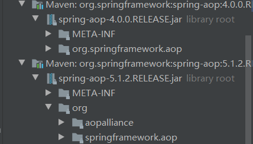

# 相关术语

**切面**

aspect :切面代表常规类，或`@Aspect`注解标注的类

**连接点**

join point:在spring中代表方法的执行

**通知**

advice:在指定连接点执行的操作

前置通知:执行连接点之前，执行

返回通知:连接点正常运行之后执行

异常通知:连接点抛出异常，执行

后置通知:无论是否正常运行，连接点执行结束均运行

环绕通知:相当于所有通知的组合

**切点**

pointcut:与通知关联，在与切点匹配处执行通知

**简介**

introduction:代表类声明的方法和字段

**目标对象**

target object,被代理的对象

**aop代理**

aop proxy,由aop框架创建的代理对象，在spring中，使用jdk动态代理，或cglib代理

使用jdk动态代理，需要一个接口。使用cglib无需接口

**织入**

weaving,创建代理对象，可以在编译时，加载时，运行时。spring中在运行时创建

# AspectJ

spring使用AspectJ的注解，但是aop运行时仍是纯java的，仅用于描述，不依赖aspectj的编译器或编织器

## 引入依赖

`aspectjweaver`包含了需要使用的注解

```xml
<dependency>
    <groupId>org.aspectj</groupId>
    <artifactId>aspectjweaver</artifactId>
    <version>1.9.2</version>
</dependency>
```

spring4的版本还需引入`aopalliance`

```xml
<dependency>
    <groupId>aopalliance</groupId>
    <artifactId>aopalliance</artifactId>
    <version>1.0</version>
</dependency>
```

spring5的版本，aop包已经把`aopalliance`内化了，无需引入 

## 开启aspectj

如果使用xml则

```xml
<aop:aspectj-autoproxy/>
```

或在配置类中,使用`EnableAspectJAutoProxy`

```java
@Configuration
@ComponentScan(basePackages = {"com.plf.spring"})
@EnableAspectJAutoProxy
public class StudentConfig {

}
```


## 声明切面

需要切面类上使用`@Aspect`注解

```java
@Aspect
@Component
public class StudentAspect {
}
```

并创建bean，当然也可以使用扫描，自动实例化

目标对象需要实现接口，也要在spring中实例化

```java
public interface Subject {
    int division(int a, int b) ;
}

```

实现方法

```java
@Component
public class Student implements Subject{
    private String studentName;
    private Integer studentAge;
    private String birthDay;

    @Override
    public int division(int a, int b) {
        return a / b;
    }
```


## 声明通知

在切面中，指定切点表达式，绑定通知

切点表达式为`execution(访问权限 返回值类型 方法全名(参数类型))`,可以使用通配符`*` 匹配多个字符或单层路径

`..`匹配任意个数和类型的参数或多层路径,例如`execution(* com.plf.spring.model..*(..))`

权限修饰符不写，可以匹配任意权限

`@Before`前置通知，`@AfterReturning`返回通知，`@AfterThrowing ` 异常通知,`@After`后置通知

```java
@Aspect
@Component
public class StudentAspect {

    @Before("execution(public int com.plf.spring.model.Student.division(int,int))")
    public void before() {
        System.out.println("前置通知");
    }

    @AfterReturning("execution(public int com.plf.spring.model.Student.division(int,int))")
    public void afterReturning() {
        System.out.println("返回通知");
    }

    @AfterThrowing("execution(public int com.plf.spring.model.Student.division(int,int))")
    public void afterThrowing() {
        System.out.println("异常通知");
    }

    @After(("execution(public int com.plf.spring.model.Student.division(int,int))"))
    public void after(){
        System.out.println("后置通知");
    }
}
```


## 使用接口实例

```java
ApplicationContext context = new AnnotationConfigApplicationContext(StudentConfig.class);
Subject subject = context.getBean(Subject.class);
int division = subject.division(1, 1);
```

使用动态代理，只能使用接口接收，无法拿到目标类对象的实例，表面上是`com.plf.spring.model.Student`的实例

实际上是`com.sun.proxy.$Proxy`的实例


## 不使用接口的方式

目标对象不实现接口,切面不变

```java
@Component
public class Student{
    private String studentName;
    private Integer studentAge;
    private String birthDay;

    public int division(int a, int b) {
        return a / b;
    }
```

可以直接得到目标类对象

```java
ApplicationContext context = new AnnotationConfigApplicationContext(StudentConfig.class);

Student student =context.getBean( Student.class);
int division = student.division(1, 1);
```

这时，spring会自动切换为cglib模式，目标类的实例类型为`com.plf.spring.model.Student$$EnhancerBySpringCGLIB`


## JoinPoint

在通知方法上，可以传入参数`JoinPoint` ,包含了切入点的信息,如参数，方法名等

```java
@Before("execution(* com.plf.spring.model..*(..))")
public void before(JoinPoint point) {
    Object[] args = point.getArgs();
    String methodName = point.getSignature().getName();
    Object target = point.getTarget();//目标对象
    Object aThis = point.getThis();//代理对象
    System.out.println("前置通知");
}
```


## 指定返回值和异常

```java
@AfterReturning(value = "execution(public int com.plf.spring.model.Student.division(int,int))",returning = "result")
public void afterReturning(int result) {
    System.out.println("返回通知,返回值为"+result);
}

@AfterThrowing(value = "execution(public int com.plf.spring.model.Student.division(int,int))",throwing = "e")
public void afterThrowing(Exception e) {
    System.out.println("异常通知 " +e.getMessage());
}
```

注解可以通过`returning`和`throwing`属性指定把返回值或异常作为参数传入通知方法


## 声明切点

编写任意名称方法，使用`@Pointcut`注解指定切点表达式,通知注解指定这个切点的方法名

```java
@Aspect
@Component
public class StudentAspect {

    @Pointcut("execution(* com.plf.spring.model..*(..))")
    public void div(){}

    @Before("div()")
    public void before(JoinPoint point) {
        Object[] args = point.getArgs();
        String methodName = point.getSignature().getName();
        Object target = point.getTarget();
        Object aThis = point.getThis();
        System.out.println("前置通知");
    }

    @AfterReturning(value = "div()",returning = "result")
    public void afterReturning(int result) {
        System.out.println("返回通知,返回值为"+result);
    }

    @AfterThrowing(value = "div()",throwing = "e")
    public void afterThrowing(Exception e) {
        System.out.println("异常通知 " +e.getMessage());
    }

    @After(("div()"))
    public void after(){
        System.out.println("后置通知");
    }

}
```


## 环绕通知

使用`@Around` 注解，必须传入`ProceedingJoinPoint`对象，如果被代理的方法有返回值，则这里也需要有返回值

需要手动执行`proceed`，否则原方法不会执行,并返回结果

```java
@Around(("div()"))
public Object around (ProceedingJoinPoint pjp) {
    Object[] args = pjp.getArgs();
    Object proceed = null;
    try {
        System.out.println("round前置通知");
        proceed = pjp.proceed(args);
        System.out.println("round返回通知");
    } catch (Throwable throwable) {
        System.out.println("round异常通知");
    } finally {
        System.out.println("round后置通知");
    }
    return proceed;
}
```


## 使用xml配置

需要先注册目标对象和切面

```xml
<bean id="studentAspect" class="com.plf.spring.aspect.StudentAspect"/>
<bean id="student" class="com.plf.spring.model.Student"/>
```

切面上无需加注解

```java
public class StudentAspect {

    public void before(JoinPoint point) {
        Object[] args = point.getArgs();
        String methodName = point.getSignature().getName();
        Object target = point.getTarget();
        Object aThis = point.getThis();
        System.out.println("前置通知");
    }

    public void afterReturning(int result) {
        System.out.println("返回通知,返回值为"+result);
    }

    public void afterThrowing(Exception e) {
        System.out.println("异常通知 " +e.getMessage());
    }

    public void after(){
        System.out.println("后置通知");
    }

    public Object around (ProceedingJoinPoint pjp) {
        Object[] args = pjp.getArgs();
        Object proceed = null;
        try {
            System.out.println("round前置通知");
            proceed = pjp.proceed(args);
            System.out.println("round返回通知");
        } catch (Throwable throwable) {
            System.out.println("round异常通知");
        } finally {
            System.out.println("round后置通知");
        }
        return proceed;
    }
}
```

定义aop配置

```xml
<aop:config>
    <aop:aspect ref="studentAspect">
        <aop:pointcut id="div" expression="execution(* com.plf.spring.model..*(..))"/>

        <aop:around method="around" pointcut-ref="div"/>
        <aop:before method="before" pointcut-ref="div"/>
        <aop:after method="after" pointcut-ref="div"/>
        <aop:after-returning method="afterReturning" pointcut-ref="div" returning="result"/>
        <aop:after-throwing method="afterThrowing" pointcut-ref="div" throwing="e"/>
    </aop:aspect>
</aop:config>
```

## 动态引入

可以在不改变目标类的前提下，动态的给目标类实现新的接口

原本的bean没有实现任何接口

```java
@Component
public class Student{
    private String studentName;
    private Integer studentAge;
    private String birthDay;

```

我们想要动态的给这个bean实现目标接口

```java
public interface Subject {
    int division(int a, int b) ;
}
```

首先需要默认的实现类

```java
public class SubjectImpl implements Subject {
    @Override
    public int division(int a, int b) {
        return a /b;
    }
}
```

通过切面引入,定义一个字段为目标接口对象，通过`DeclareParents`注解，定义要被添加的目标类和该接口的默认实现类

可以使用通配符匹配多个字符，结尾`+`表示包含子类

```java
@Aspect
@Component
public class SubjectIntroducer {

    @DeclareParents(value = "com.plf.spring.*.Student+",defaultImpl = SubjectImpl.class)
    public static Subject subject;
}
```

使用被代理后的对象，转换为目标接口，即可使用目标接口的方法

```java
Student student =context.getBean( Student.class);
Subject subject = (Subject) student;
int division = subject.division(10, 2);
```

等价的xml配置

```xml
<aop:aspect>
    <aop:declare-parents types-matching="com.plf.spring.*.Student+"
                         implement-interface="com.plf.spring.model.Subject"
                         default-impl="com.plf.spring.model.SubjectImpl"/>
</aop:aspect>
```

