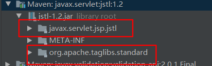
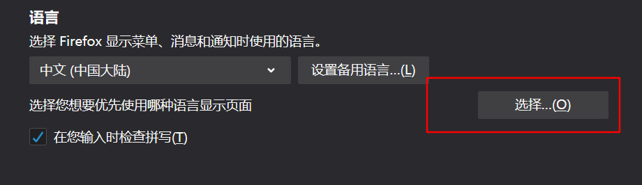
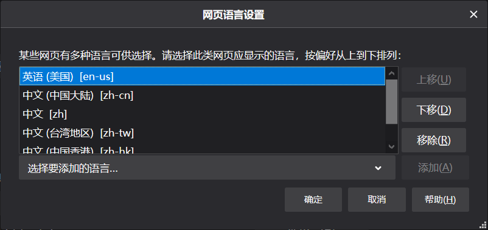
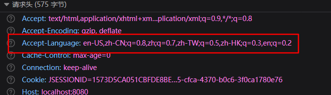
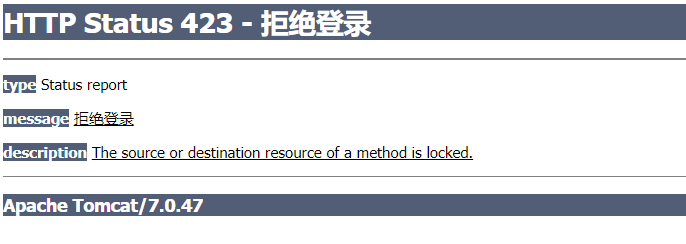

# 拦截器

拦截器类似于过滤器的功能

编写拦截器，需要先实现`HandlerInterceptor`接口

```java
@Slf4j
public class MyInterceptor implements HandlerInterceptor {

    @Override
    public boolean preHandle(HttpServletRequest request, HttpServletResponse response, Object handler) throws Exception {
        log.info("preHandler---");
        return true;
    }

    @Override
    public void postHandle(HttpServletRequest request, HttpServletResponse response, Object handler, ModelAndView modelAndView) throws Exception {
        log.info("postHandle---");
    }

    @Override
    public void afterCompletion(HttpServletRequest request, HttpServletResponse response, Object handler, Exception ex) throws Exception {
        log.info("afterCompletion---");
    }
}
```

注册拦截器

```xml
<mvc:interceptors>
    <bean class="com.plf.smvc.interceptor.MyInterceptor"/>
</mvc:interceptors>
```

默认会拦截所有请求，也可以使用更详细的配置，拦截指定请求

```xml
<mvc:interceptors>
    <mvc:interceptor>
        <mvc:mapping path="/getStudent"/>
        <bean class="com.plf.smvc.interceptor.MyInterceptor"/>
    </mvc:interceptor>
</mvc:interceptors>
```

执行顺序为，preHandler > RequestMapping > postHandle >  完成响应 > afterCompletion

preHandler  的 返回值 绝定是否放行，true为通过

# 参数校验

基于jsr-303的注解,使用 hinernate-validation的实现

## 基本使用

引入依赖,会自动依赖 `javax.validation:validation-api:2.0.1.Final `

**注意**,不用使用 6 及以上的版本，会依赖 el-api 3.0 ，tomcat7插件加入会和之前的2.2重复，不生效

```xml
<dependency>
    <groupId>org.hibernate</groupId>
    <artifactId>hibernate-validator</artifactId>
    <version>5.3.4.Final</version>
</dependency>
```

对需要校验的bean，加上 jsr-303 的注解

如`javax.validation.constraints.NotNull` ,目标值不能为空,还可以指定一个错误消息

```java
@Data
public class Student {
    @NotNull(message = "学生姓名不能为空")
    private String studentName;
    private Integer studentAge;
    private Book book;
}

```

无需配置，使用`@Valid`标注要校验的bean，同时传入一个`BindingResult`对象，得到校验结果

根据校验结果，自行做出处理，该校验框架并不会阻止程序运行

```java
@ResponseBody
@RequestMapping("getStudent")
public String getStudent(@Valid Student student, BindingResult bindingResult) {
    if (bindingResult.hasErrors()) {
        ObjectError objectError = bindingResult.getAllErrors().get(0);
        String msg = objectError.getDefaultMessage();
        return msg;
    }
    log.info("getStudent----");
    return "success";
}
```

如果返回的消息有乱码,在RequestMapping注解中指定产生的数据类型

```java
@RequestMapping(value = "getStudent",produces = MediaType.APPLICATION_JSON_UTF8_VALUE)
```


# 国际化

## 页面使用

编写Resource Bundle国际化文件，`文件名_语言_地区.properties`，如`ui_zh_CN.properties`

```properties
username=Username
```

```properties
username=用户名
```

加载国际化文件

```xml
<bean id="messageSource" class="org.springframework.context.support.ResourceBundleMessageSource">
    <property name="basenames">
        <array>
            <value>i18n.ui</value>
            <value>i18n.end</value>
        </array>
    </property>
</bean>
```

引入标签库

```xml
<dependency>
    <groupId>javax.servlet</groupId>
    <artifactId>jstl</artifactId>
    <version>1.2</version>
</dependency>

<!--        <dependency>-->
<!--            <groupId>taglibs</groupId>-->
<!--            <artifactId>standard</artifactId>-->
<!--            <version>1.1.2</version>-->
<!--        </dependency>-->
```

如果 jstl 的版本是 1.2 ，则不需要引用 standard 的包，因为已经内化了

否则会告警 `TLD skipped. URI: http://java.sun.com/jstl/core_rt is already defined`



使用标签头

```jsp
<%@ taglib prefix="fmt" uri="http://java.sun.com/jsp/jstl/fmt" %>
```

jsp 页面使用 key 来指定键,直接获取值

```jsp
<fmt:message key="username"/>
```

打开浏览器的语言设置

选择优先的语言



则发送请求时，请求头会携带这些语言参数



DispatcherServlet的initLocaleResolver方法 会注册 LocaleResolver,会去寻找一个名为`localeResolver`的bean

没有则使用默认的，默认配置在 `DispatcherServlet.java`同目录下的`DispatcherServlet.properties`

默认为`AcceptHeaderLocaleResolver`,将从请求头中得到语言参数

## 后台使用

后台可以直接注入一个`MessageSource`实例，调用`getMessage`方法，映射方法的参数可以直接传入`Locale`对象

```java
@Autowired
private MessageSource messageSource;

@RequestMapping("getStudent")
public String getStudent(Student student, Locale locale) {
    String username = messageSource.getMessage("username", null, locale);
    log.info("getStudent----");
    return "/success.jsp";
}
```

## SessionLocaleResolver

使用 基于 session  的语言参数解析器`SessionLocaleResolver`，

并设置拦截器，每次请求时，默认将参数名为`locale`的值存入`SessionLocaleResolver`中

```xml
<bean id="localeResolver" class="org.springframework.web.servlet.i18n.SessionLocaleResolver"/>

<mvc:interceptors>
    <bean class="org.springframework.web.servlet.i18n.LocaleChangeInterceptor"/>
</mvc:interceptors>
```

请求时，带上该参数即可切换语言,不过不能直接请求 jsp 页面，需要经过 controller

```html
<a href="/smvc/getStudent?locale=zh_CN">中文</a>
<a href="/smvc/getStudent?locale=en_US">英文</a>
```


# 异常处理

## ExceptionHandler

直接在 controller 中编写方法，使用`@ExceptionHandler`注解，

当这个类中的RequestMapping方法发生异常时，则会调用ExceptionHandler的方法，主要用于跳转到错误页面，页面上显示错误的类型

```java
@ResponseBody
@RequestMapping("getStudent")
public String getStudent(Integer a, Integer b) {
    log.info("getStudent----" + a / b);
    return "success";
}

@ExceptionHandler
public ModelAndView exceptionHandle(Exception ex) {
    ModelAndView mv = new ModelAndView("error.jsp");
    mv.addObject("error", ex.getMessage());
    return mv;
}
```

可以针对特定异常类型做详细处理

```java
@ExceptionHandler({ArithmeticException.class,NullPointerException.class})
```

## ControllerAdvice

直接写在 controller 中， 只在当前类中生效，可以使用`ControllerAdvice`，应用到所有 controller

```java
@ControllerAdvice
public class ErrorController {

    @ExceptionHandler({ArithmeticException.class,NullPointerException.class})
    public ModelAndView exceptionHandle(Exception ex) {
        ModelAndView mv = new ModelAndView("error.jsp");
        mv.addObject("error", ex.getMessage());
        return mv;
    }
}
```

## ResponseStatus

自定义一个异常,使用ResponseStatus，

```java
@ResponseStatus(reason = "拒绝登录",value = HttpStatus.LOCKED)
public class MyException extends Exception {
}
```

当方法抛出该异常时

```java
@ResponseBody
@RequestMapping("getStudent")
public String getStudent(Integer a) throws MyException {
    if(a.equals(0)){
        throw  new MyException();
    }
    log.info("getStudent----" );
    return "success";
}
```

会显示一个服务器错误信息



# 文件上传下载

## 下载

首先通过io的方式把文件转为 byte 数组，可以使用`org.springframework.util.FileCopyUtils`工具类转换

构造`ResponseEntity`实例并返回

```java
@RequestMapping("getStudent")
public ResponseEntity<byte[]> getStudent() {
    Resource resource = new ClassPathResource("/logback.xml");
    byte[] bts = null;
    try (InputStream inputStream = resource.getInputStream()) {
        bts = FileCopyUtils.copyToByteArray(inputStream);
    } catch (IOException e) {
        e.printStackTrace();
    }

    HttpHeaders headers = new HttpHeaders();
    headers.setContentDispositionFormData("attachment", resource.getFilename());
    headers.setContentType(MediaType.APPLICATION_OCTET_STREAM);
    return new ResponseEntity<>(bts, headers, HttpStatus.CREATED);
}
```

## 上传

需要加入依赖

```xml
<dependency>
    <groupId>commons-io</groupId>
    <artifactId>commons-io</artifactId>
    <version>2.6</version>
</dependency>
<dependency>
    <groupId>commons-fileupload</groupId>
    <artifactId>commons-fileupload</artifactId>
    <version>1.3.3</version>
</dependency>
```

配置文件处理器,并设置大小限制，和默认编码

id 必须为 `multipartResolver` ,`DispatcherServlet`的`initMultipartResolver` 方法会去按id查找该bean

```xml
<bean id="multipartResolver" class="org.springframework.web.multipart.commons.CommonsMultipartResolver">
    <property name="defaultEncoding" value="UTF-8"/>
    <property name="maxUploadSize" value="#{1024*1024*10}"/>
</bean>
```

form 表单 需指定`enctype`

```html
<form action="getStudent" method="post" enctype="multipart/form-data">
    姓名:<input  type="text" name="studentName"><br>
    年龄:<input  type="text" name="studentAge"><br>
    生日:<input  type="text" name="birthday"><br>
    证件: <input type="file" name="pic"><br>
    <input type="submit" value="提交">
</form>
```

方法使用`MultipartFile` ,并使用`@RequestParam`标注文件名称

得到文件名，并使用`transferTo`保存

```java
@ResponseBody
@RequestMapping("getStudent")
public String getStudent(Student student,@RequestParam("pic") MultipartFile file) {
    String fileName = file.getOriginalFilename();
    File fileTemp  = new File("E://download/"+fileName);
    try {
        file.transferTo(fileTemp);
    } catch (IOException e) {
        e.printStackTrace();
    }
    return "success";
}
```

如果前端是使用`ajax`传输文件，还携带参数的话，需要用到`formData`对象

```js
let formData = new FormData();
formData.append('file', file.raw);
formData.append('type', this.newForm.type);
formData.append('name', this.newForm.name);

fetch({
    url: API.createAccurateAct,
    method: 'post',
    contentType: 'multipart/form-data',
    data: data
});
```


# Rest

REST即表述性状态传递（英文：Representational State Transfer，简称REST） 

使用同一的资源定位符，通过状态，也就是请求方式来绝对操作

不用rest时

```
/getBook?id=1  查询图书
/putBook       修改图书
/postBook?id=1 添加图书
/deleteBook?id=1 删除图书
```

使用rest

```
/book/1   PUT请求    修改图书
/book/1   GET请求    查询图书
/book     POST请求   添加图书
/book/1   DELETE请求 删除图书
```

## HiddenHttpMethodFilter

配置一个过滤器,该过滤器会拦截POST请求，如果参数中带有`_method`,则根据该参数调用对应的请求方式的映射

```xml
<filter>
    <filter-name>hiddenHttpMethodFilter</filter-name>
    <filter-class>org.springframework.web.filter.HiddenHttpMethodFilter</filter-class>
</filter>
<filter-mapping>
    <filter-name>hiddenHttpMethodFilter</filter-name>
    <url-pattern>/*</url-pattern>
</filter-mapping>
```

请求的表单,需指定为POST请求，并携带`_method`参数值为'delete'

```html
<form action="student/12" method="post">
    <input type="hidden" name="_method" value="delete">
    <input type="submit" value="删除学生">
</form>
```

对应的mapping,这里直接使用了`DeleteMapping`

```java
@DeleteMapping("/student/{id}")
public String deleteStudent(@PathVariable String id) {
    log.info("删除学生:" + id);
    return "success";
}
```

tomcat8以上的版本，不允许其他请求方式转发到`jsp`页面，需要加上`isErrorPage="true"`

```jsp
<%@ page contentType="text/html;charset=UTF-8" language="java" isErrorPage="true" %>
```

