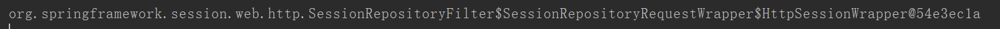
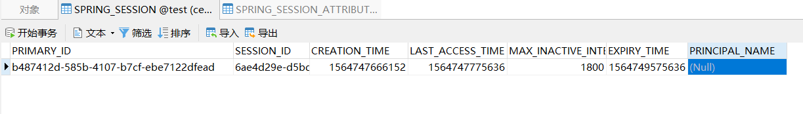
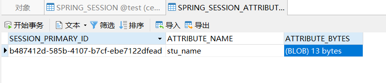

# jdbc

## 加入依赖

添加`spring-session-jdbc`的依赖，及mvc

```xml
<dependency>
    <groupId>org.springframework.session</groupId>
    <artifactId>spring-session-jdbc</artifactId>
    <version>2.1.7.RELEASE</version>
</dependency>

<dependency>
    <groupId>org.springframework</groupId>
    <artifactId>spring-webmvc</artifactId>
    <version>5.1.8.RELEASE</version>
</dependency>
```

## 配置spring

```xml
<context:annotation-config/>

<!--这是一个配置类，该类会创建相应的springSessionRepositoryFilter-->
<bean class="org.springframework.session.jdbc.config.annotation.web.http.JdbcHttpSessionConfiguration"/>

<!--配置数据源-->
<bean id="dataSource" class="com.zaxxer.hikari.HikariDataSource">
    <property name="driverClassName" value="com.mysql.jdbc.Driver"/>
    <property name="jdbcUrl" value="jdbc:mysql://localhost:3306/test?useSSL=false"/>
    <property name="username" value="root"/>
    <property name="password" value="123456"/>
</bean>

<!--    事物管理-->
<bean class="org.springframework.jdbc.datasource.DataSourceTransactionManager">
    <property name="dataSource" ref="dataSource"/>
</bean>

<!--数据库初始化脚本-->
<jdbc:initialize-database>
    <jdbc:script location="classpath*:org/springframework/session/jdbc/schema-drop-mysql.sql"/>
    <jdbc:script location="classpath*:org/springframework/session/jdbc/schema-mysql.sql"/>
</jdbc:initialize-database>
```

并使用DispatcherServlet或ContextloadListener加载配置

## 配置过滤器

```xml
<filter>
    <filter-name>springSessionRepositoryFilter</filter-name>
    <filter-class>org.springframework.web.filter.DelegatingFilterProxy</filter-class>
</filter>
<filter-mapping>
    <filter-name>springSessionRepositoryFilter</filter-name>
    <url-pattern>/*</url-pattern>
    <dispatcher>REQUEST</dispatcher>
    <dispatcher>ERROR</dispatcher>
</filter-mapping>
```

## 测试

编写servlet,在session存入一个属性，并打印session

```java
@Override
protected void doPost(HttpServletRequest req, HttpServletResponse resp) throws ServletException, IOException {
    HttpSession session = req.getSession();
    session.setAttribute("stu_name","张三");
    System.out.println(session);
    req.getRequestDispatcher("index.jsp").forward(req,resp);
}
```

转发到jsp

```html
<h1>${sessionScope.stu_name}</h1>
```

启动tomcat，访问servlet

控制台打印的session,可以看到HttpSession被替换了实现类



此时的数据，新增了两张表


spring_session记录session



spring_session_attributes记录session的属性，通过主键对应sessionid

由于会存入数据库，被存的属性对象需要实现**序列化**接口



