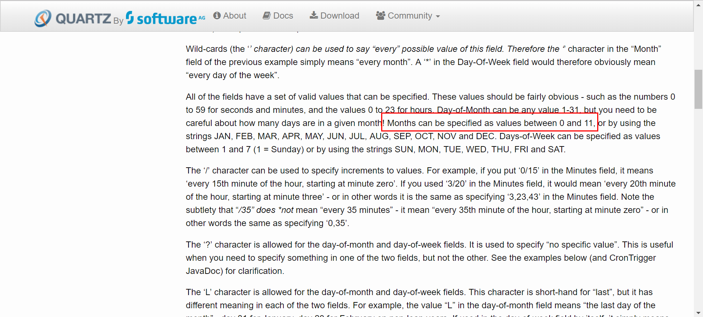
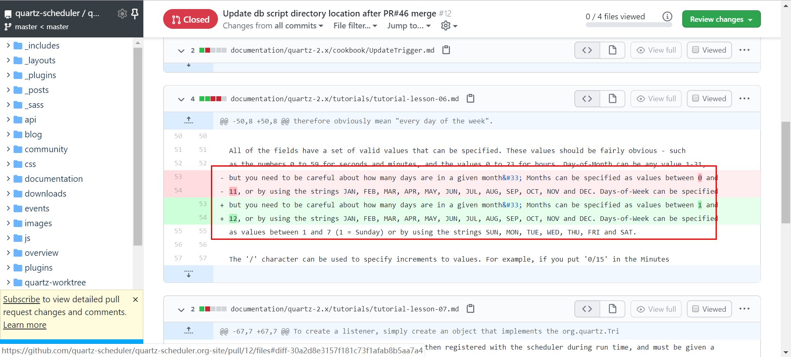

# 概述

quartz 是一款企业级的任务调度框架。

# 基本使用

引入依赖

```xml
<dependency>
    <groupId>org.quartz-scheduler</groupId>
    <artifactId>quartz</artifactId>
    <version>2.3.0</version>
</dependency>
```

启动一个默认调度器

```java
public static void main(String[] args) {
    try {
        Scheduler scheduler = StdSchedulerFactory.getDefaultScheduler();
        scheduler.start();
	    // 在这直接编写任务
        scheduler.shutdown();
    } catch (SchedulerException e) {
        e.printStackTrace();
    }
}
```

此时没有任何任务执行，我们现在来创建一个任务。

任务类 实现 `org.quartz.Job` 接口。

```java
@Slf4j
public class HelloJob implements Job {

    @Override
    public void execute(JobExecutionContext jobExecutionContext) throws JobExecutionException {
        log.info("hello quartz");
    }
}
```

调度器 Scheduler 进行一个调度任务，由两部分构成

`JobDetail` 任务详情，指定了任务类，任务名称，任务组，和执行的任务的参数。

`Trigger` 触发器，指定了触发规则和调度规则

```java
public static void main(String[] args) {
    try {
        Scheduler scheduler = StdSchedulerFactory.getDefaultScheduler();
        scheduler.start();
		// 创建任务详情
        JobDetail jobDetail = JobBuilder.newJob(HelloJob.class)
            .withIdentity("job1", "group1")
            .build();
		// 创建触发器
        Trigger trigger = TriggerBuilder.newTrigger()
            .withIdentity("trg1", "group1")
            .startNow()
            .withSchedule(SimpleScheduleBuilder.simpleSchedule()
                          .withIntervalInSeconds(10)
                          .repeatForever())
            .build();
		// 进行调度
        scheduler.scheduleJob(jobDetail,trigger);

        //scheduler.shutdown();
    } catch (SchedulerException e) {
        e.printStackTrace();
    }
}
```

以上 `JobDetail`任务详情指定 `HelloJob` 为任务类，和任务组，任务名

触发器 `Trigger` 设置了触发器名称，触发器组，触发方式（立即启动），调度规则（每10s执行一次,不停止）

查看日志,每10s执行一次


# 传递参数

创建任务详情时设置参数` JobDataMap`,也可以直接设置`JobData`，job 通过 `JobDetail`获取。

```java
JobDataMap jobDataMap=new JobDataMap();
jobDataMap.put("username","张三");
jobDataMap.put("age",12);

JobDetail jobDetail = JobBuilder.newJob(HelloJob.class)
    .withIdentity("job1", "group1")
    .usingJobData(jobDataMap)
    .usingJobData("address","北京")
    .build();
```

通过`JobExecutionContext`获取

```java
@Slf4j
public class HelloJob implements Job {
    @Override
    public void execute(JobExecutionContext jobExecutionContext) throws JobExecutionException {
        JobDataMap jobDataMap = jobExecutionContext.getJobDetail().getJobDataMap();

        String username = jobDataMap.getString("username");
        int age = jobDataMap.getInt("age");
        String address = jobDataMap.getString("address");

        log.info("hello,{},{},{}",username,age,address);
    }
}
```

如果按照bean规范对Job进行属性设置，并存在 set/get 方法，则创建任务的时候`JobFactory`会自动对这些属性赋值

```java
@Slf4j
@Data
public class HelloJob implements Job {

    private String username;
    private Integer age;
    private String address;

    @Override
    public void execute(JobExecutionContext jobExecutionContext) throws JobExecutionException {
        log.info("hello,{},{},{}",username,age,address);
    }
    
}
```

# 状态与并发

默认情况下，如果一个任务的执行时间，超过了调度的周期时间，则调度会另起一个线程，继续执行任务。

```java
@Slf4j
public class HelloJob implements Job {
    @Override
    public void execute(JobExecutionContext jobExecutionContext) throws JobExecutionException {
        log.info("start");
        try {
            // 执行消耗设置为5s
            TimeUnit.SECONDS.sleep(5);
        } catch (InterruptedException e) {
            e.printStackTrace();
        }
        log.info("end");
    }
}

// 调度周期设置为3s
Trigger trigger = TriggerBuilder.newTrigger()
    .withIdentity("trg1", "group1")
    .startNow()
    .withSchedule(SimpleScheduleBuilder.simpleSchedule()
                  .withIntervalInSeconds(3)
                  .repeatForever())
    .build();
```

以上的demo，当过了3s后，会再开一个任务，此时存在多个任务并发执行的场景


如果只希望同时只存在一个线程执行该job，通过注解`@DisallowConcurrentExecution` 标注。

```java
@Slf4j
@DisallowConcurrentExecution
public class HelloJob implements Job {
```

此时相当于加了同步,第二个任务会等待其他任务执行完才执行。


如果希望执行完一次任务后，下次任务执行更新后的数据，而不是一开始设置的数据，则需要

使用注解`@PersistJobDataAfterExecution`标注任务类后，数据则会更新。

通常与 `@DisallowConcurrentExecution` 一起使用，防止两个job线程同时修改数据，引发线程安全问题。

```java
@Slf4j
@Data
@PersistJobDataAfterExecution
public class HelloJob implements Job {
    private String username;
    private Integer age;
    private String address;
    @Override
    public void execute(JobExecutionContext jobExecutionContext) throws JobExecutionException {
        log.info("hello,{},{},{}", username, age, address);
		// 执行完后，更新jobData数据
        JobDataMap jobDataMap = jobExecutionContext.getJobDetail().getJobDataMap();
        jobDataMap.put("age", ++age);
    }
}
```

得到


# Trigger

## 触发时间

可以设置 开始触发时间，和结束触发时间

```java
// 2020年9月4日，17点25分10s
Date startTime = DateBuilder.dateOf(17, 25, 10, 4, 9, 2020);
Date endTime = DateBuilder.dateOf(17, 26, 10, 4, 9, 2020);

Trigger trigger = TriggerBuilder.newTrigger()
    .withIdentity("trg1", "group1")
    .startAt(startTime)
    .endAt(endTime)
    .withSchedule(SimpleScheduleBuilder.simpleSchedule()
                  .withIntervalInSeconds(3)
                  .repeatForever())
    .build();
```

## SimpleTrigger

简单的触发器，可用定义一个任务，什么时候执行，执行几次。

ex: 不做任何设置，立即触发，只执行一次。可用通过以上的设置触发时间

```java
Trigger trigger =TriggerBuilder.newTrigger()
    .withIdentity("trg1", "group1")
    .build();
```

ex: 绑定一个调度规则，此时生成的对象为 SimpleTrigger ，

repeat 表示重复，interval 表示间隔 ，两者需配合设置。只设置间隔，不设置重复，将只执行一次。只设置重复，不设置间隔或间隔为0会报错。

```java
SimpleTrigger trigger = TriggerBuilder.newTrigger()
    .withIdentity("trg1", "group1")
    .withSchedule(SimpleScheduleBuilder.simpleSchedule()
                  .withIntervalInSeconds(3)
                  .repeatForever())
    .build();
```

以上 方法是 `withIntervalInSeconds` 表示每次执行间隔多少秒，类似的方法还有 `withIntervalInMilliseconds` 毫秒，`withIntervalInMinutes` 分钟，`withIntervalInHours` 小时。

`repeatForever()` 表示一直重复，直到结束时间。 还可以使用`withRepeatCount()` 指定重复次数。

```java
SimpleTrigger trigger = TriggerBuilder.newTrigger()
    .withIdentity("trg1", "group1")
    .withSchedule(SimpleScheduleBuilder.simpleSchedule()
                  .withIntervalInMinutes(1)
                  .withRepeatCount(3))
    .build();
```

以上代码，设置重复n次，总共会执行 n+1 次任务。

## CronTrigger

CronTrigger 是触发器的一种，通过一个 cron 表达式来定义任务如何执行。

使用 `CronScheduleBuilder` 定义，cron 表达式 是使用 七个子表达式组成，年为可选项 ，最少为六位。

完整cron表达式  为 `秒 分 时 当月天数 月 当周天数 年(可选)`

```java
CronTrigger trigger = TriggerBuilder.newTrigger()
    .withIdentity("trigger1", "group1")
    .withSchedule(CronScheduleBuilder.cronSchedule("0/5 * * * * ?"))
    .build();
```

每个字段都有一个有效值， 秒和分钟的值为 0-59  ，时的值为 0-23，当月天数的值为 1-31 

**但是**，这个月份的定义有点坑 

[官方文档](http://www.quartz-scheduler.org/documentation/quartz-2.3.0/tutorials/tutorial-lesson-06.html)上的说明是，定义为 0-11 ，或是使用 字符串简写



而网上的一些杂贴，前一节说 0-11,后一节说 1-12 ，搞得很乱。

而实际使用时，如果把月份设置为 0 ,则会抛出异常，表示月份必须为 1-12

```
Exception in thread "main" java.lang.RuntimeException: CronExpression '0/5 * * * 0 ?' is invalid.
	at org.quartz.CronScheduleBuilder.cronSchedule(CronScheduleBuilder.java:111)
	at com.plf.quartz.App.main(App.java:28)
Caused by: java.text.ParseException: Month values must be between 1 and 12
```

设置为当前月，比如现在 九月，设置为 9 或 SEP ，任务刚好是执行的，设为其他则不执行。

查看官方github，确实是个issue，有对应的文档修复pr，但是并没有部署



**最终**,月份应该使用 1-12 来定义。

当周天数的有效值为 1-7 ，其中 1 为 星期s天 sunday ,2-7接着为 周一到周六 ，当周天数和当天月份不能同时设置，设置了其中一个，另一个需设置为 `?`

年份的有效值就为公历的年份，比如2020 ，作为可选配置，可以不填。

特殊写法：

`-` : 表示从有个值到某个值 ，比如  月份设置为 `MAY-SEP` 或 `5-9`  ，表示 五月到九月都生效。

`*` : 表示每一个，任何。比如，秒字段设置为`*` 表示每秒都会执行。

`,` : 表示集合，比如月份设置为 `SEP,DEC` ，则表示 九月和 十二月生效。还可以与`-`一起使用，比如`MAY-SEP,DEC` 表示五月到九月和十二月生效。

`/` : 表示增量，比如在秒字段设置为 `32/5` 表示从32秒开始执行第一次，隔5秒执行一次，下次执行为37秒，再下次为42秒，依次类推。

`?` : 该符号只能用于 ，当周天数和当月天数，表示 无指定值，这两个字段特殊值只能设置其中一个，不能同时设置，另一个需设置为 `?`

`L` : 可以用于 周天 和 月天 字段，用于月天表示 每月的最后一天，比如 1月31日，非闰年的2月28日。用于周天的话，则表示 7 或 SAT ，表示周六，如果L在一个数字后面表示，每月的最后一个星期几，如6L 或 FRIL ，表示每月最后一个周五。

`W` : 表示工作日

`#` : 表示工作日

# WEB

# 持久化

# spring

# springboot

