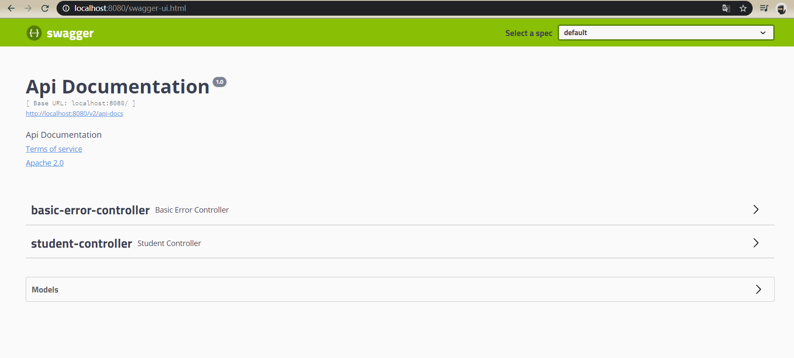
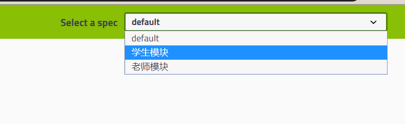
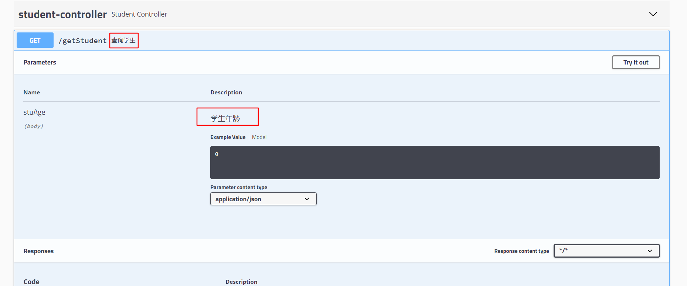

# 概述

swagger 是一款生成 api 文档的工具。

# 使用

在 springboot 项目中，添加依赖

```xml
<dependency>
    <groupId>io.springfox</groupId>
    <artifactId>springfox-swagger2</artifactId>
    <version>2.9.2</version>
</dependency>
<dependency>
    <groupId>io.springfox</groupId>
    <artifactId>springfox-swagger-ui</artifactId>
    <version>2.9.2</version>
</dependency>
```

编写配置类，开启 swagger的功能

```java
@EnableSwagger2
@Configuration
public class SwaggerConfig {
}
```

启动项目访问 `http://localhost:8080/swagger-ui.html` 



## 文档基本信息

通过一个核心对象 `springfox.documentation.spring.web.plugins.Docket` 来控制，创建bean覆盖掉默认值。

设置标题，描述和作者等。

```java
@Bean
public Docket docket() {
    Contact contact = new Contact("张三", "https://www.bilibili.com/", "aa@qq.com");
    ApiInfo apiInfo = new ApiInfo("哔哩哔哩项目文档",
                                  "提供api接口文档",
                                  "v3.14",
                                  "https://www.bilibili.com/",
                                  contact,
                                  "Apache 2.0",
                                  "http://www.apache.org/licenses/LICENSE-2.0",
                                  new ArrayList());
    return new Docket(DocumentationType.SWAGGER_2).apiInfo(apiInfo);
}
```


## 扫描路径

通过 `Docket.select` 指定接口路径或访问路径做过滤，默认扫描所有接口。

```java
return new Docket(DocumentationType.SWAGGER_2)
                .apiInfo(apiInfo)
                .select()
                .apis(RequestHandlerSelectors.basePackage("com.plf.swagger.controller"))
                .paths(PathSelectors.ant("/**"))
                .build();
```

## 是否启用

通过链式调用 `enable`方法传递一个布尔值，false则关闭。

```java
return new Docket(DocumentationType.SWAGGER_2)
    .apiInfo(apiInfo)
    .enable(false);
```

通过会自定义一个属性来控制是否启用，在 application.properties 中配置如下属性。

```properties
swagger.enable=true
```

在配置类中获取该属性并使用,当没有该值时默认为 false。

```java
@Value("${swagger.enable:false}")
private Boolean enableSwagger;
```

## 分组

通过设置 groupName 指定分组，可以有多个 Docket 实例。

```java
@Bean
public Docket docket2(){
    return new Docket(DocumentationType.SWAGGER_2).groupName("学生模块");
}
@Bean
public Docket docket3(){
    return new Docket(DocumentationType.SWAGGER_2).groupName("老师模块");
}
```



## Model注释

当我们有一个实体类

```java
public class Student {
    public String stuName;
    public Integer stuAge;
}
```

请求接口的返回值为实体类时，会扫描到。

```java
@RestController
public class StudentController {

    @RequestMapping("getStudent")
    public Student getStudent(){
        Student student=new Student();
        student.stuName="张三";
        student.stuAge=12;
        return student;
    }
}
```


可以使用相关注解添加描述注释。

```java
@ApiModel("学生对象")
public class Student {
    @ApiModelProperty("学生姓名")
    public String stuName;
    @ApiModelProperty("年龄")
    public Integer stuAge;
}
```

有了注释后


## 接口注释

描述接口

```java
@ApiOperation("查询学生")
@GetMapping("getStudent")
public  Student getStudent(@ApiParam("学生年龄") Integer stuAge){
    Student student=new Student();
    student.stuName="张三";
    student.stuAge=stuAge;
    return student;
}
```



